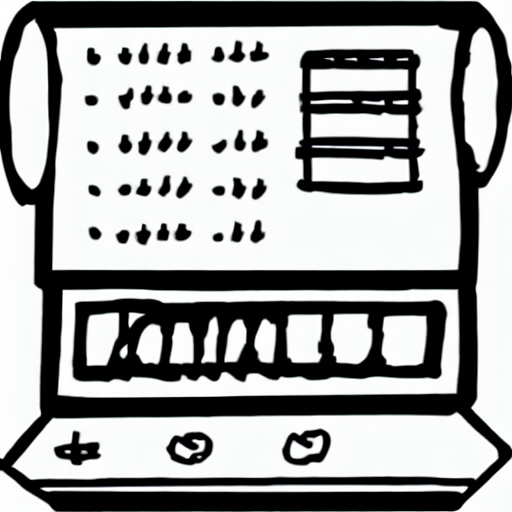

<!---
To update:
    logo          - Project logo
  info.
    toc           - Table of Contents of README
--->

> PICDAC

 []

PICDAC is an audio amplifier interface built using the PIC16F887A microcontroller.

  

<!---
Example table of contents:
* header
  * sub header
--->
## Table of contents

